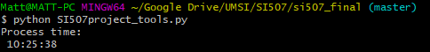

# Library of Congress Newspaper History

Matt Hanger

[Link to this repository](https://github.com/mwhanger/si507_final)

---

## Project Description

This project aims to aggregate historical newspaper statistics by state, utilizing the [Library of Congress ‘Chronicling America’ API](https://chroniclingamerica.loc.gov/search/titles/) and its data around newspapers printed within the United States between 1690 and the present day. The project will allow users to see how many newspapers have been published in the history of the country and within each state, to see how many newspapers are currently still being published. The project will also allow users to find some interesting facts around the newspapers, such as the most common year for newspapers ceasing publication, and how many papers ceased or began publication in a given year.

The Library of Congress helpfully provides guides and tutorials for using their APIs [here](https://labs.loc.gov/lc-for-robots/).

## How to run (the Flask app - `SI507_final.py`)

1. First, you should install the dependencies contained in the requirements.txt file, using the command `pip install -r requirements.txt`.
2. From a terminal at the directory containing __all__ of the project python files, run the SI507_final.py file with the command `python3 SI507_final.py runserver`, and then keep the terminal open in the background.
3. Open a web browser and navigate to http://127.0.0.1:5000/ to see the home page generated by the flask application, which provides a dynamic count of the number of news papers stored in the database, and provides links to this github repository as well as one of the main routes (`/papers/`), which in turn displays all the papers with valid start dates (after 1600, not 9999) in chronological order, at 25 per page.
4. See below for additional routes to explore within the Flask application.
5. **NOTE:** Due to the amount of time the Project Tools file takes to retrieve, clean, and load all API data into the project database, it has been entirely separated out of the main SI507_final.py file. See directly below for how to run the Project Tools file (SI507project_tools.py).

## How to run (Project Tools - `SI507project_tools.py`)
#### __WARNING__: The project tools file takes an excessive time to run to completion! The full version of the resulting processed data, `chroniclingamerica.sqlite`, is included in this repo so that the project tools do not need to be ran.
1. First, you should install the dependencies contained in the requirements.txt file, using the command `pip install -r requirements.txt`.
2. From a terminal at the directory containing __all__ of the project python files, run the project tools with `python3 SI507project_tools.py`. No API keys or extra setup apart from installing require packages is neccessary - the LOC API is publicly available.
3. Settle in for the long haul -- __there are nearly 160,000 records to retrieve, and the total runtime may take nearly 11 hours!__
4. 
5. The tools file caches all results from the API in a `loc_cache.sqlite` database. A `chroniclingamerica.sqlite` is created with the resulting processed data after the first set of 100 results from the API are processed. The database and project tools file have integrity checks -- each time the tools are ran, they will check the database to see what the most recent 'page' of 100 results was that was retrieved from the database, and they will resume there. IN OTHER WORDS, if you process 20 pages of data from the API and then stop the script, the next time you run it, it will resume from page 20, verify all records and relationships from that page are in place in the database, and then continue on.

## How to run (Project Tests - `SI507project_tests.py`)
1. First, you should install the dependencies contained in the requirements.txt file, using the command `pip install -r requirements.txt`.
2. From a terminal at the directory containing __all__ of the project python files, run the SI507_final.py file with the command `python3 SI507project_tests.py`.
3. Wait for results to appear from the four included tests.

---
## Routes in this application
- `/` -> This is the home page. It displays a dynamic count of the number of records in the database, and links users to the main `/papers` route, containing a full list in chronological order of all newspapers in the database. Also contains a link to this github repo.
- `/papers` -> Contains a full list in chronological order of all newspapers in the database, 25 returned per page. A number can be added to the end, as in `/papers/2`, to look at a specific page of 25 results. Links are provided at the bottom of the page to go to the next page of 25 results, or previous page of 25 results.
- `/papers/<state>` -> If a state (with proper casing and spaces -- i.e., `/papers/Michigan` or `/papers/Nebraska` or `/papers/South Carolina`) is added after `/papers`, papers specifically for that state are returned in chronological order, 25 per page.
- `/ended/<year>` -> Using this route, such as `/ended/1965`, returns all newspapers that ceased publication in the year 1965, 25 per page.
- `/ended/<state>/<year>` <- Similar to the regular ended route, but returns papers just for the specific state that ceased publication in the given year.
- `/started/<year>` -> Using this route, such as `/ended/1975`, returns all newspapers that started publication in the year 1975, 25 per page.
- `/started/<state>/<year>` <- Similar to the regular started route, but returns papers just for the specific state that started publication in the given year.

## In this repository:
- templates
  - `base_generic.html` - Simple html body with a css link to extend other templates off of.
  - `papers_list.html` - Template for displays using the `/papers` base route.
  - `pub_years.html` - Template for displays using the `/started` and `/ended` base routes.
- `SI507_final.py` - The main file containing the flask application. Relies on the models.py file, and the chroniclingamerica.sqlite database.
- `models.py` - The file containing all of the Flask-SQLAlchemy class model definitions for the newspaper data in the flask app and corresponding sqlite database. Used by `SI507_final.py` and `SI507project_tools.py`.
- `SI507project_tools.py`- A file which creates a context within the flask app, retrieves and caches data from the LoC API, and cleans and loads it into the chroniclingamerica.sqlite database via Flask-SQLAlchemy. Runs separate from the main `SI507_final.py`, but imports a Flask app context from it. Also imports `models.py`.
- `SI507project_tests.py` - A file containing four simple unit tests, two which test the `chroniclingamerica.sqlite` database, and two which test the existance of the flask app and the definitions of the models by importing `SI507_final.py`.
- `chroniclingamerica.sqlite` - The **FULL** sqlite database of newspaper metadata from the Library of Congress Chronicling America API, containing the data and tables used by the flask application - provided in full since retrieving the full dataset by API takes hours.
- `sample_loc_cache.sqlite` - An _example_ sqlite database containing cached data from the Library of Congress API, creating using the `requests-cache` python library. The fully cached copy of API data for all records was too large to upload to github.
- `test_string.json` - Example JSON data saved as a text file from the LoC database -- used to figure out the models, and for testing purposes early on.
- `db_schema.jpg` - an image outlining the basic schema for the models used in the flask application. Some revisions may have been made since this was originally drafted.
- `requirements.txt` - A file containing the python libraries and their versions required in order for this flask application and its associated files to run.

---
## Code Requirements for Grading
Please check the requirements you have accomplished in your code as demonstrated.
- [x] This is a completed requirement.
- [ ] This is an incomplete requirement.

Below is a list of the requirements listed in the rubric for you to copy and paste.  See rubric on Canvas for more details.

### General
- [x] Project is submitted as a Github repository
- [x] Project includes a working Flask application that runs locally on a computer
- [x] Project includes at least 1 test suite file with reasonable tests in it.
- [x] Includes a `requirements.txt` file containing all required modules to run program
- [x] Includes a clear and readable README.md that follows this template
- [x] Includes a sample .sqlite/.db file
- [x] Includes a diagram of your database schema
- [x] Includes EVERY file needed in order to run the project
- [x] Includes screenshots and/or clear descriptions of what your project should look like when it is working

### Flask Application
- [x] Includes at least 3 different routes
- [x] View/s a user can see when the application runs that are understandable/legible for someone who has NOT taken this course
- [x] Interactions with a database that has at least 2 tables
- [x] At least 1 relationship between 2 tables in database
- [x] Information stored in the database is viewed or interacted with in some way

### Additional Components (at least 6 required)
- [x] Use of a new module (`requests-cache`)
- [ ] Use of a second new module
- [ ] Object definitions using inheritance (indicate if this counts for 2 or 3 of the six requirements in a parenthetical)
- [x] A many-to-many relationship in your database structure
- [ ] At least one form in your Flask application
- [x] Templating in your Flask application
- [ ] Inclusion of JavaScript files in the application
- [x] Links in the views of Flask application page/s - pagination on pages, link on home route to `/papers/` route
- [ ] Relevant use of `itertools` and/or `collections`
- [ ] Sourcing of data using web scraping
- [x] Sourcing of data using web REST API requests
- [ ] Sourcing of data using user input and/or a downloaded .csv or .json dataset
- [x] Caching of data you continually retrieve from the internet in some way

### Submission
- [x] I included a link to my GitHub repository with the correct permissions on Canvas! (Did you though? Did you actually? Are you sure you didn't forget?) -- Repo is public, grader added as collaborator
- [x] I included a summary of my project and how I thought it went **in my Canvas submission**!
